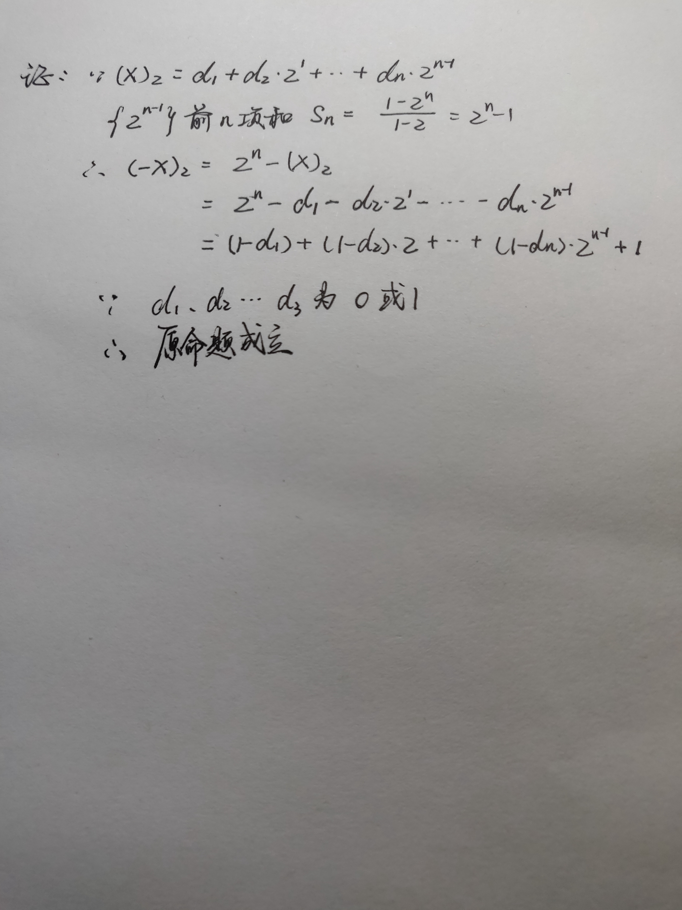

我的第三次作业

part1

1）x=(01000011)2 ；y=(11111001)2 ；z=(10110110)2

2）x=(11010011)2 ,x溢出；

3）x=(11010011)2

4）x=(01111111)2 ;y=(11111001)2 ;
z溢出

5）x=(1.001000)2

6）x=(10111.000000)2

7）x=(0.011100)2 ,x出现精度误差

part2-1

1）&emsp;In mathematics and computing, the method of complements is a technique used to subtract one number from another using only addition of positive numbers. 

在数学和计算中，取补方法是一种只用正数的加法从一个数减去另一个数的技术。

2）&emsp;The byte is a unit of digital information that most commonly consists of eight bits, representing a binary number.

字节是数字信息的一个单元，通常由八个比特组成，表示二进制数。

3）&emsp;In computer science, an integer is a datum of integral data type, a data type that represents some range of mathematical integers.

在计算机科学中，一个整数是一个整数数据的类型,表示某种数学整数范围的数据的类型。

4）&emsp;In computing, floating-point arithmetic (FP) is arithmetic using formulaic representation of real numbers as an approximation so as to support a trade-off between range and precision. 

在计算中，浮点运算是一种用实数的公式表示近似的算术，以用来支持范围和精度之间的折中。

part2-2

1）

2）x=(00000361)8

part2-3

1）x=oxe1, y=(ffffffe1)8

part2-4

&emsp;In computing, NaN, standing for not a number, is a numeric data type value representing an undefined or unrepresentable value, especially in floating-point calculations.