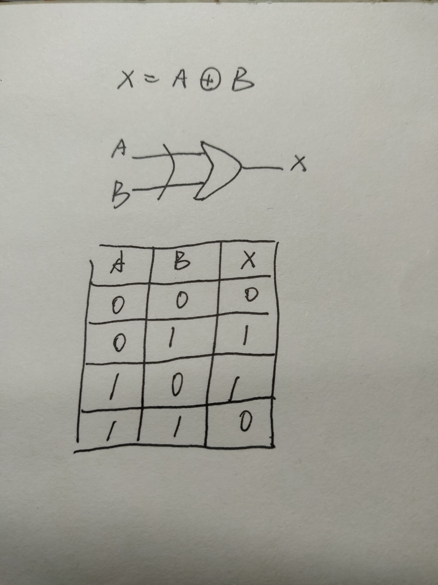
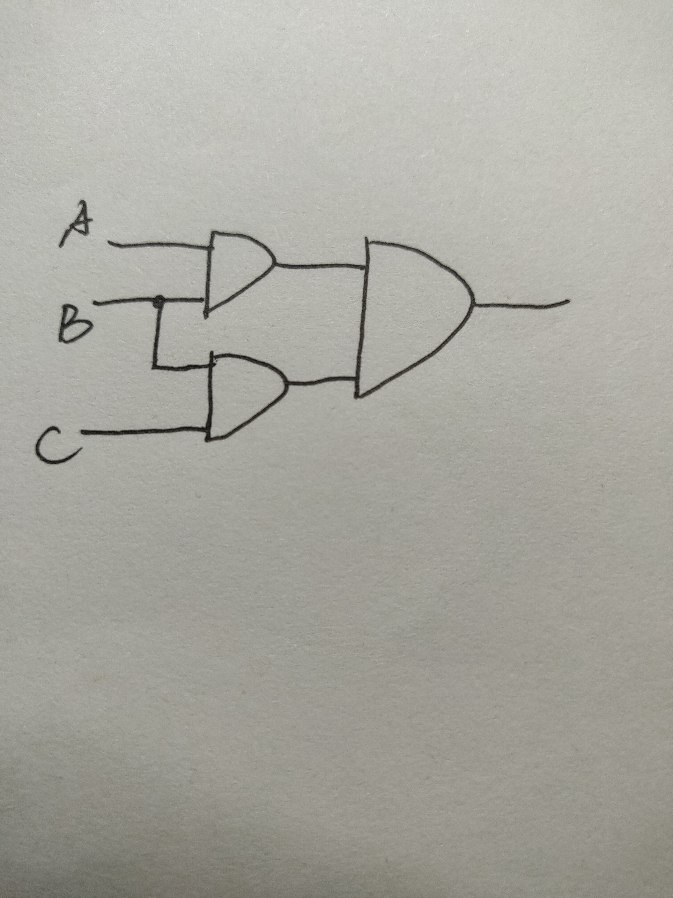

我的第五次作业

part 1

1）

2）

3)

4）

5）

part 2

7）
(1）(X8X7X6X5X4X3X2X1
)2

（2）（X8X7X6X50000)2

(3)
(X8X7X6X5X'4X'3X'2X'1
)2

part 3-1

1）In electronics, a logic gate is an idealized or physical device implementing a Boolean function; that is, it performs a logical operation on one or more binary inputs and produces a single binary output. 

2）In mathematics and mathematical logic, Boolean algebra is the branch of algebra in which the values of the variables are the truth values true and false, usually denoted 1 and 0 respectively. 

part3-2

1）触发器

2）1