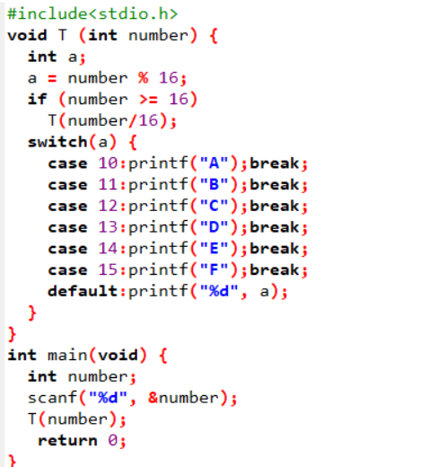
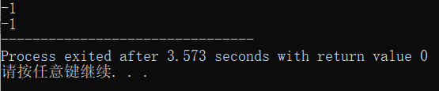
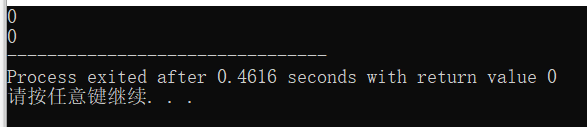
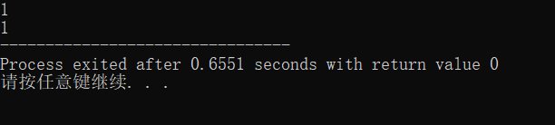
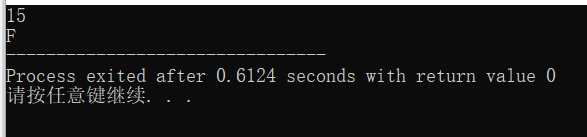
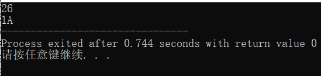
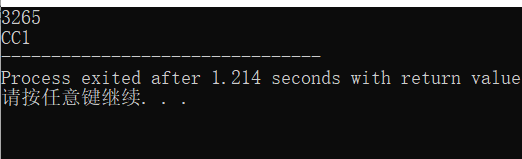
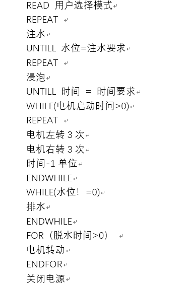

我的第八次作业

1.
1）FUNCTION A (num) 

a = num % 16

2.IF number / 16 != 0 THEN 

A(num/16)

3.CASE num % 16 OF 

condition 10~15:PRINTF: A, B,
 C, D, E, F

4.OTHERS: 

PRINT:a

2）

3）

2.
1）A top-down approach (also known as stepwise design and in some cases used as a synonym of decomposition) is essentially the breaking down of a system to gain insight into its compositional sub-systems in a reverse engineering fashion.

2）A work breakdown structure (WBS), in project management and systems engineering, is a deliverable-oriented decomposition of a project into smaller components.

3）同：分解一个子系统

异：Top-down由上到下，WBS根据不同类别分成小的部分

3.

（1）

0）选择洗衣模式：对应水位

1）注水：水位计计水位

2）浸泡：计时器计时

3）电机转动：左三次，右三次

4）排水：水位计计水位

5）电机转动脱水

6）结束

（2）

（3）

同：都是为了清洗干净衣物

异：快速洗衣没有浸泡步骤

（4）
洗衣模式（A B C）

浸泡时间(A B C)

电机转动速率(A B C)

脱水时间(A B C)

