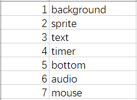

我的第九次作业

1.

2.对象有：

1.background

2.sprite

priest（三个）、
devil（三个）、
bank（两个）、
baot（一个）、
welldone！（一个）、
gameover failed（一个）、
try again（一个）、
play again（一个）、
play（一个）、
wave（一个）

3.text

time left（一个）、
game instructions（一个）

4.timer

计时器一个

5.bottom

try again（一个） 、
play again（一个） 、
play（一个） 、
add （一个） 、
play more game（一个） 、
 。。。。。.com（一个） 、
add game to your site（一个）

6.audio

背景音乐（一个）、
恶魔坏笑音效（一个）、
过关音乐（一个）、
划船音乐（一个）、
选择人物的音乐 （一个）

7.mouse

3.类是一个抽象的概念，类没有动作，而对象做到了实体化，有特定的动作和功能。如“牧师”属于“sprite”，“牧师”有上船下船的动作。

4.魔鬼(恶魔)属性：

图片texture、名字name、大小size、初始位置position、可见性visible、动画animation、动作behaviors、初始位点original point

方法：

关于动作behaviors在事先写好代码，规定好坐标与时间（pixel）的关系，成为函数，恶魔的动作有旋转，行走或者说是平台动作，mirror翻转

大小相当于自变量，人为设定，与视觉相关

可见性与图像显示函数相关，是一种透明度的设定，

动画通过动画编辑器添加动画帧数，播放的时候连贯播放即可

初始位点是用来标记兑现的关键，后期设定即可，相当于输入代码的的自变量

5.when devil is onclick

if the devil is near the bank the boat is by

devil play a animation ,devil rotate ,devil on boat ,play audio

else

nothing change

6.不会