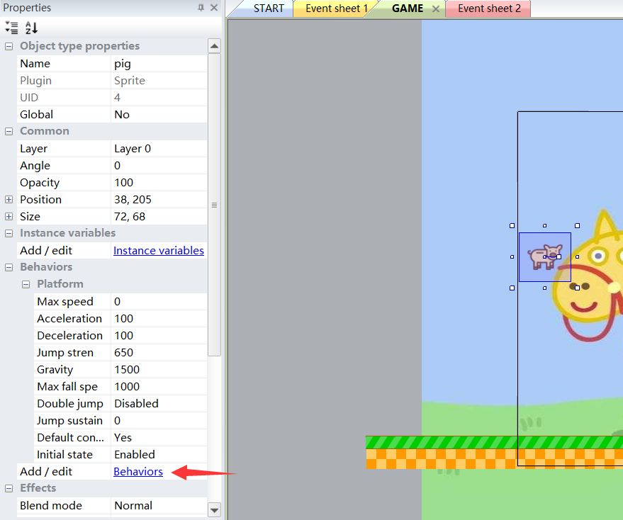
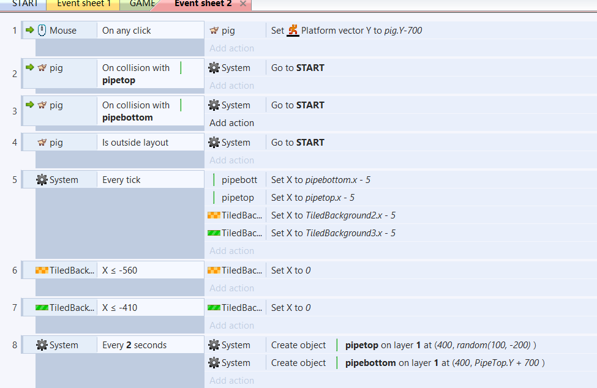
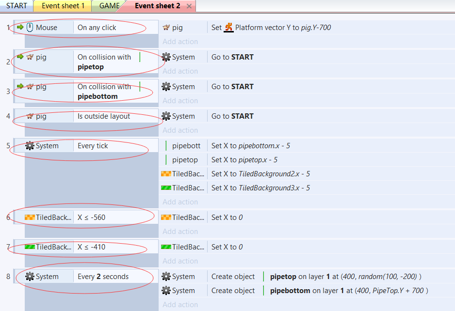
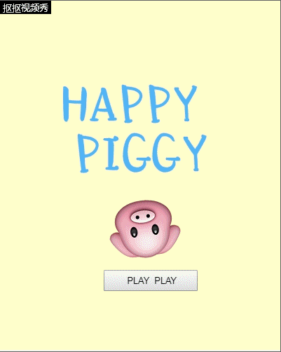

# 简易制作Flappy bird类游戏

## *新手制作construst2平台游戏*

一.前言

&emsp;&emsp;flappy bird是一款由来自越南的独立游戏开发者Dong Nguyen所开发的作品，简单上手，娱乐刺激。对于construst2新手，是简单易上手制作的一款游戏。

二.准备

&emsp;&emsp;安装construst2,准备所需图标

三.制作过程

&emsp;&emsp;
step1:创建新项目，创建两个图层，命名为“start”与“game”，调整大小“400,500”,将"Fullscreen in Browser"改为  "Off"。

&emsp;&emsp;
step2:制作start页面，右键点击insert,插入图片与button，并调整sheet为如图所示。

&emsp;&emsp;
step3:制作属于你的游戏画面！自由id你的图标与界面！右键insert,调整图标位置。

接下来，给小猪设置动作,如图

"behavios"中选择"platform"

"max speed"调为0

&emsp;&emsp;
step4:进入sheet2,进行动作调节，如图

&emsp;&emsp;
step5:点击左上角播放，开始体验游戏吧！

