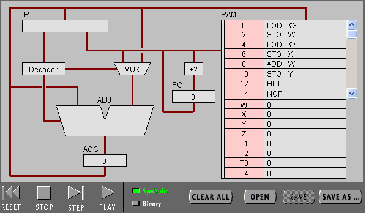
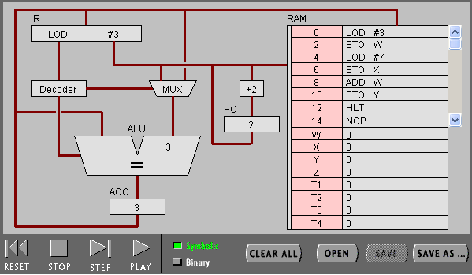
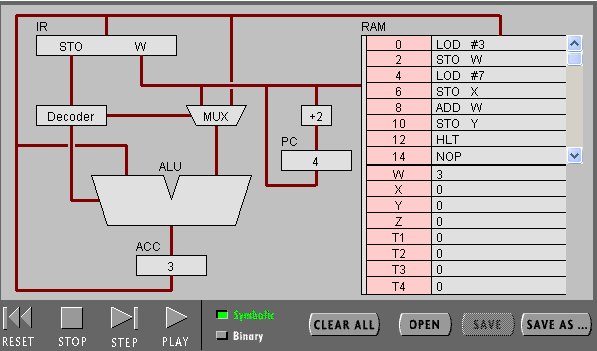
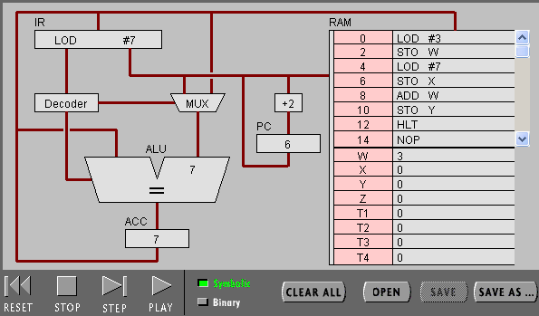
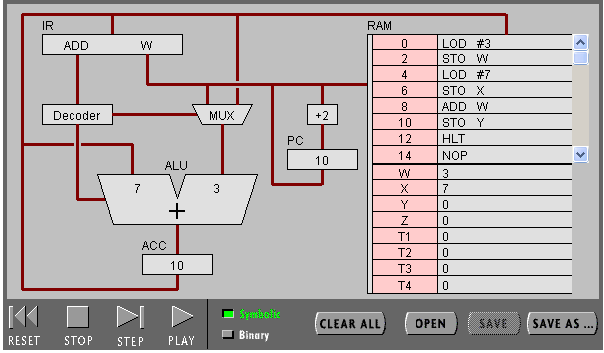
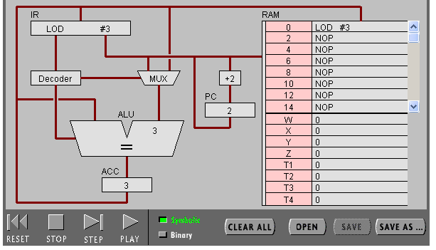
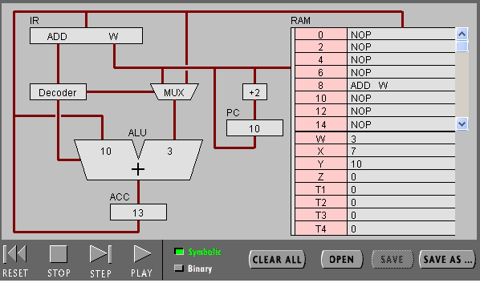
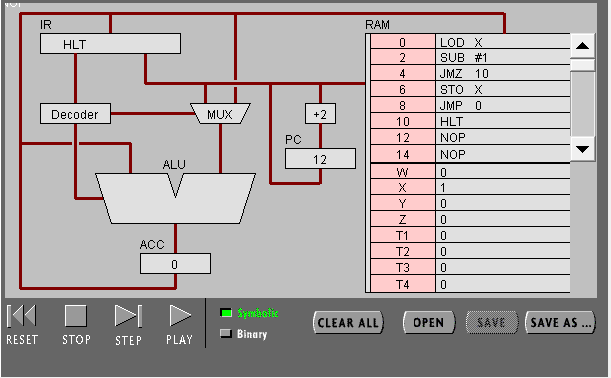
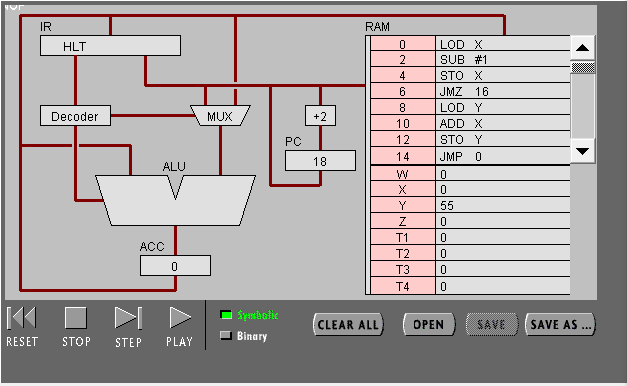
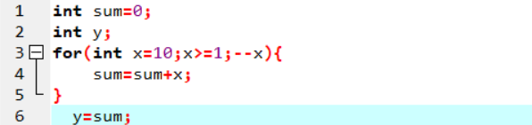

实验报告

任务一

part1

1）PC:指示指令在存储器的存放位置

IR指令寄存器是用来存放指令的，存放当前正在执行的指令，包括指令的操作码，地址码，地址信息 

2）ACC全称：累加器

作用:存放数据，运算

3）

1.pc根据地址从RAM取指令LOD #3 

2.指令传入IR，指令传入Decoder，无需取址，3直接传入MUX 

3.数据3传入ALU，再传入ACC

4）

1.PC根据地址从RAM取指令ADD W 

2.指令传入IR，再传入Decoder 

3.ALU从ACC中取值 

4.IR再次访问RAM中的W，从W中取值 

5.W的值读入ALU 

6.ALU执行加法，结果传入ACC

5)ADD W需要两次访问RAM，LOD #3只有一次 

part2

1)00010100 00000111 

前一个是命令指示，后一个是操作数

2)指令和数据都存储在RAM

3）16位

4)

part2

1）
1.递减x至x小于0

2.

2）
1.

2.

00000100 10000001

00010001 00000001

00000101 10000001

00001101 00010000

00000100 10000010

00000000 10000001

00000101 10000010

00001100 00000000

00001111 00000000
3.联系：机器语言和高级语言都可以实现顺序，选择和循环

区别：高级语言更加直观，更加便于编程，机器语言必须根据机器的执行顺序运行
