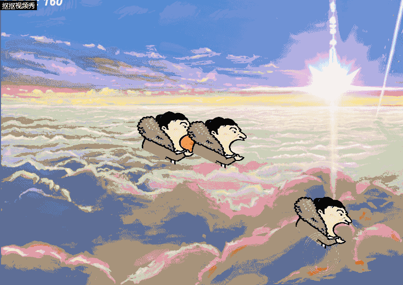

# 制作简易射击游戏

一.游戏策划

楔子(Setting)：2018年英雄联盟S8总决赛上，王思聪王校长的吃热狗图爆红网络。如今热狗大军从天而降，王校长踏上了吃掉热狗拯救世界的英雄之路。

人设与道具（Game Sprites）：

1.Player：王校长。王校长通过影分身之术吞掉热狗。

2.Boss：热狗。从天而降，无穷无尽。

玩法：

通过控制王校长走位发射分身消除热狗，王校长接触到热狗游戏结束。

二.游戏设计

1.

Object:热狗

Attribute:图片，位置

Events & Actions：碰撞&销毁自己

2.

Object:王校长

Attribute:图片，位置

Events & Actions：发射分身

3.

Object：王校长的分身

Attribute:图片，位置

Events & Actions：碰撞&销毁自己

