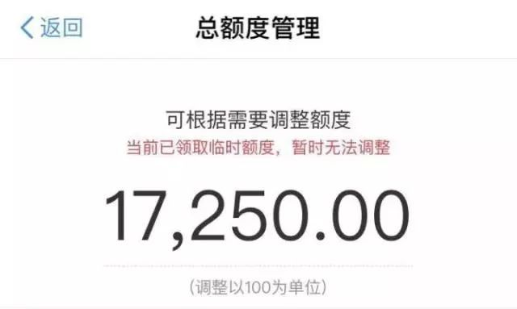

# 支付宝的一个伦理风险行为收集

&emsp;&emsp;近年来，电商平台兴起，每年的“双十一”“双十二”等购物狂欢节，成为买家卖家平台的一场狂欢盛宴。购物车中物品一件件叠加，但卡里的余额却在一点点减少。

&emsp;&emsp;支付宝app中带有“花呗”这一产品，用户在消费时，可以预支花呗额度，享受先消费、后付款的购物体验。但是花呗中过高的额度，可能存在着伦理风险。
http://www.sohu.com/a/207272818_755197

&emsp;&emsp;这是笔者在搜狐看见的一篇文章，从文章中我们可以看见，

这是花呗给一个大四学生的额度，引用原作者的话，“一名未毕业、也没有工作的学生，随时随地能透支一两万的额度消费，这件事情合理吗？越发好奇，如果家长知道自己的孩子可以一下子借这么多钱，会有什么反应。”

&emsp;&emsp;“其实不用调查就知道，大学生的还款能力是很低的。没有稳定收入，只能靠生活费续命。可尽管如此，大量的平台还是轻易，甚至草率地，向年轻消费者群体大开超前消费之门。这是现代社会便利性的体现，但同时，也能算是一种陷阱吧。”使用花呗，理性当先。